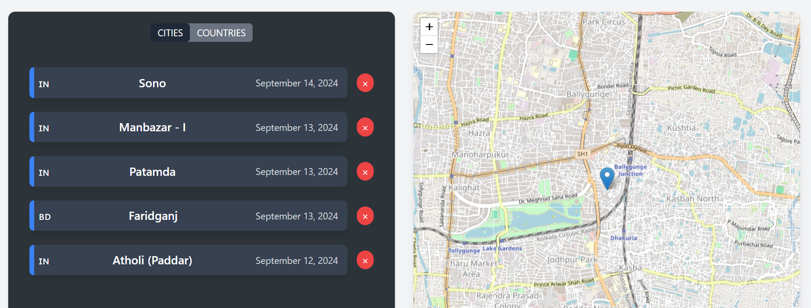
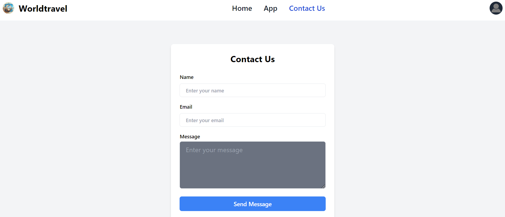

# WorldTravel - Frontend

WorldTravel is a fully authenticated application where users can sign up, log in, reset passwords, and save or delete cities and countries they have traveled to on an interactive map. The frontend is built using React with state management powered by Redux, and the UI is styled with Tailwind CSS.

## Features

1. **User Sign-up**: Users can sign up with email verification and a profile image.
2. **User Login**: Allows users to log in to their accounts.
3. **Password Reset**: Users can change their passwords.
4. **Traveled Cities & Countries**: Users can save their traveled cities and countries on a map.
5. **Delete Saved Cities**: Users can delete saved cities.
6. **Pagination**: Cities are displayed with pagination for easy navigation.
7. **Full Authentication**: The application ensures that only authenticated users can access the main features.

## Screenshots

### Homepage


### User Dashboard


### Contact Us Page


## Technologies

- React
- Redux Toolkit
- React Query
- React Router
- Axios
- Leaflet (for interactive maps)
- Tailwind CSS
- Vite (for build and development)

## Setup

1. Clone the repository:
    ```bash
    git clone https://github.com/akshay-chaulya/worldtravel.git
    cd worldtravel/frontend
    ```

2. Install dependencies:
    ```bash
    npm install
    ```

3. Create a `.env` file and add the necessary environment variables:
    ```plaintext
    VITE_API_URL=<your-backend-url>
    ```

4. Start the development server:
    ```bash
    npm run dev
    ```

5. Build for production:
    ```bash
    npm run build
    ```
